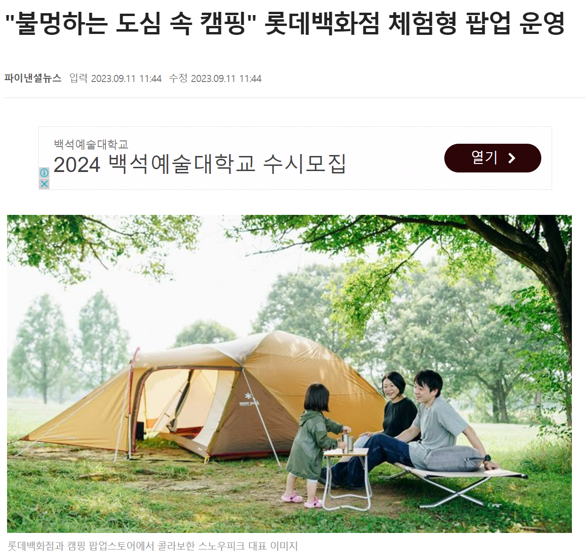
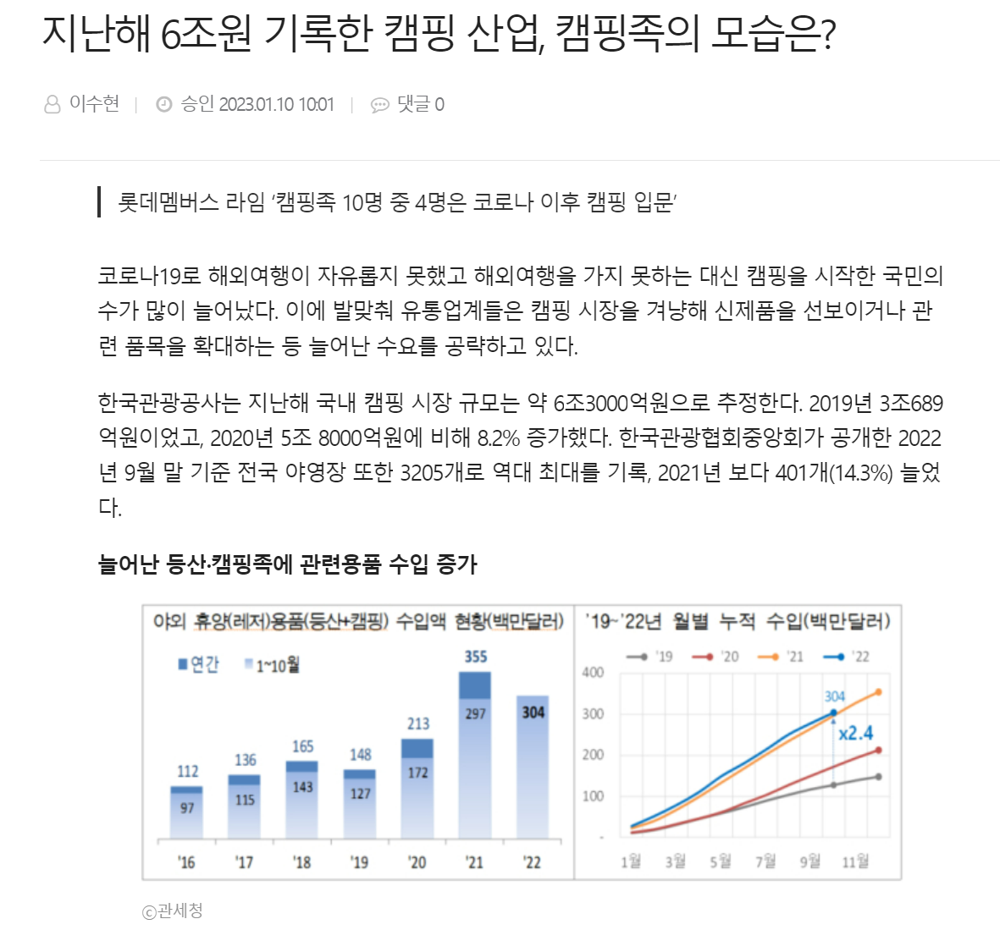

# 🏕️ 캠핑온탑 campingOnTop

 
 
 

# 🖥️ [PLAYDATA] 한화시스템 BEYOND SW캠프   team MTM
## 팀원
### 임태우 길민석 이준국 한경훈 장대현

 

### [시연영상]
 

### [DB 설계 회고]

 
 
 

# 🎯 프로젝트 소개
‘캠핑온탑’은 일상에서 벗어나고 싶지만 멀리 가기 힘든 사람들이 도심 속에서

캠핑을 즐길 수 있도록 여러 루프탑 등의 장소들을 중개 및 제공하는 서비스이다.

 
private하게, 교통 정체도 피하고 싶은 바쁜 현대인들이 

멀지 않은 곳에서

밤에 루프탑에서 야경을 보며 조용히 힐링할 수 있는 기회를 제공한다.

 
 

# ✒️ 프로젝트 배경
일상에서 벗어나고 싶지만 멀리 가기 힘든 사람들을 위해

"도심 속 캠핑"이라는 주제로 프로젝트가 시작되었다.

 
공실인 원룸, 상가 등을 보유한 사람들이 장기, 단기 임대를 주기 어려운 상황,

모텔, 파티룸 등에는 가기에 부담스럽고, 또 멀리 가기 힘든 사람들의 상황 등에 적합한 중개 플랫폼이다.

 

### "사전 준비가 필요 없는 도심 캠핑"
비교적 가까운 서울 근교의 캠핑장들이 있지만 우선 그곳까지 이동해야 하고

캠핑, 바베큐 등을 즐기기 위해선 여러 사전 준비를 해야 한다. 하지만

### 캠핑온탑
서비스를 이용해 사전에 장비를 렌탈한다면

언제든지 내가 있는 위치 주변에 있는 여러 캠핑사이트에 방문할 수 있다.

 

[출처](https://www.fnnews.com/news/202309111118245826)

[출처](https://www.dailypop.kr/news/articleView.html?idxno=65833)

 
근래 캠핑을 즐기는 소위 "캠핑족"들이 기하급수적으로 늘어나고 있다.  
그에 따라 수도권 근교에 수많은 캠핑장들이 들어섰다.  

### 캠핑온탑
서비스는 그 열기와 수요를 기대하며
도심 속에서 틀을 벗어난 휴식을 제공한다.

 
 

# 🔍 프로젝트 시나리오

 
 

# ⚒️ System Architecture

