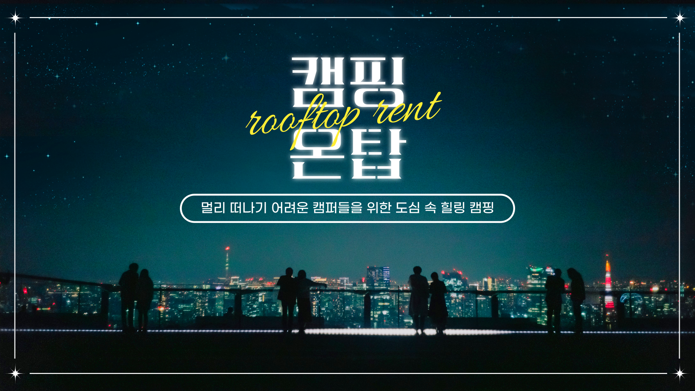
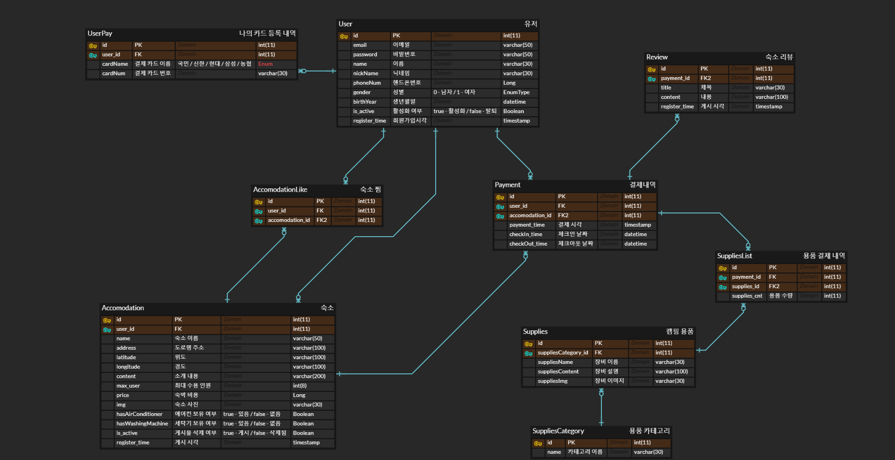
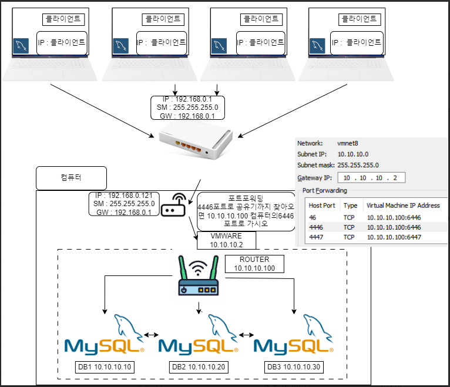
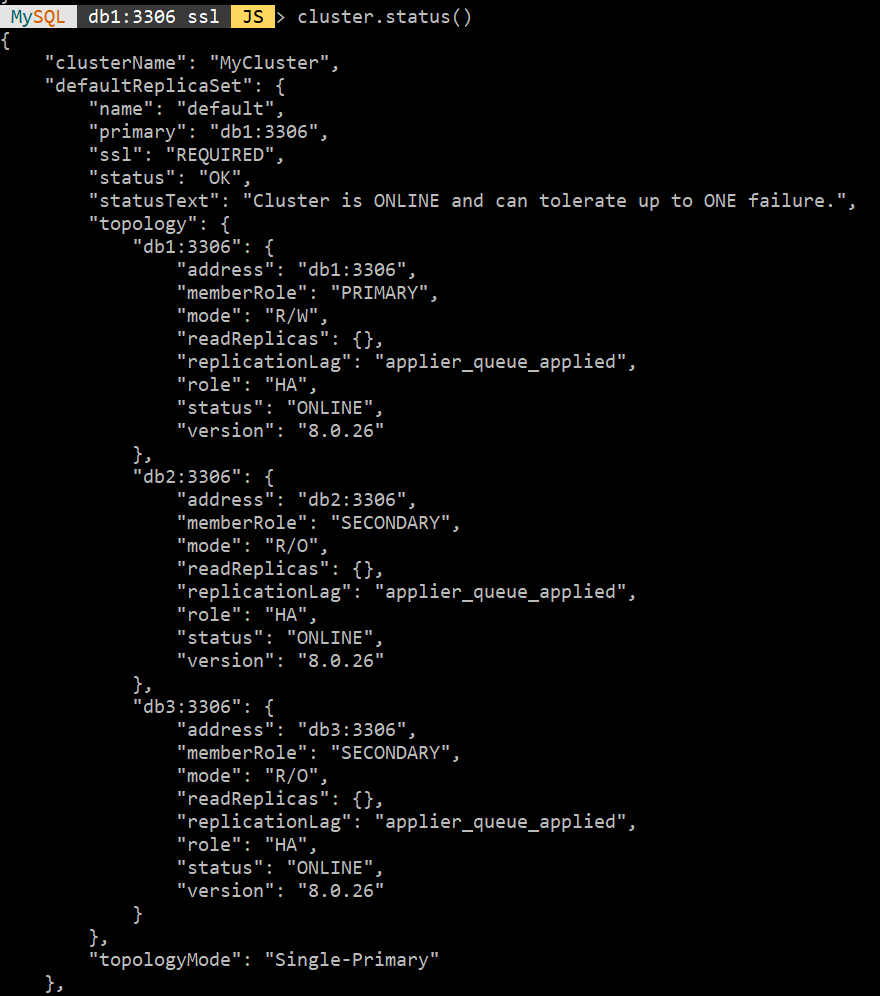
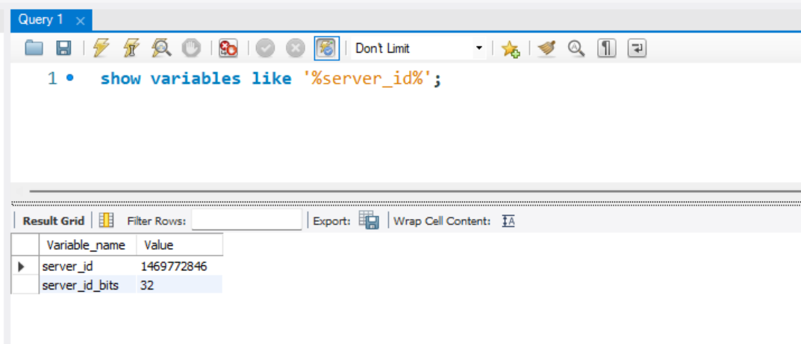
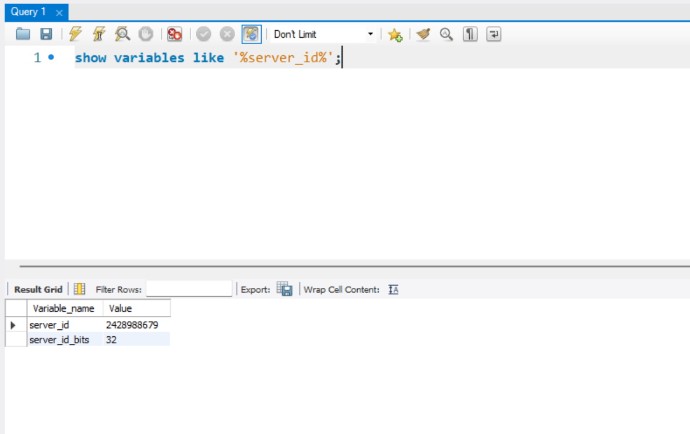

# 🏕️ 캠핑온탑 campingOnTop

 
 
 

# 🖥️ [PLAYDATA] 한화시스템 BEYOND SW캠프   team MTM
## 팀원
### 임태우 길민석 이준국 한경훈 장대현

 

### [Cluster 서버 시연 영상]
[ClusterVideo](https://github.com/beyond-sw-camp/be02-1st-MTM-cityCamp/assets/105422037/6f2fccec-7a6e-4ef3-8501-19ec6cb29423)

 
 
 

# 🎯 프로젝트 소개
‘**캠핑온탑**’은 일상에서 벗어나고 싶지만 멀리 가기 힘든 사람들이 도심 속에서

캠핑을 즐길 수 있도록 여러 루프탑 등의 장소들을 중개 및 제공하는 서비스이다.

 
private하게, 교통 정체도 피하고 싶은 바쁜 현대인들이  

멀지 않은 곳에서

밤에 루프탑에서 야경을 보며 조용히 힐링할 수 있는 기회를 제공한다.

 
 
 

# ✒️ 프로젝트 배경
일상에서 벗어나고 싶지만 멀리 가기 힘든 사람들을 위해

“**도심 속 캠핑**” 이라는 주제로 프로젝트가 시작되었다.    

그리고 공실인 원룸, 상가 등을 가지고 있는 사람들이 장기, 단기 임대를 주기 어렵고

모텔, 파티룸 등에는 가기 부담스럽고 멀리 가기 힘든 사람들을 위한 중개 플랫폼이다.

 

***“사전 준비가 필요 없는 도심 캠핑”***
  - 서울 근교의 캠핑장이라도 그곳까지 방문해 캠핑을 하기 위해선
    많은 준비가 필요하다.
  - 장비 렌탈 서비스를 제공해 캠퍼들의 사전 준비의 번거로움을 덜 수 있다.

 

private하게 사용할 수 있고 차량 정체도 피할 수 있는 바쁜 현대인이

밤에 루프탑에서 야경을 보며 조용히 힐링할 수 있는 기회를 제공한다.

 
 
 

# 🔍 프로젝트 시나리오 (요구사항 분석)
[상세 보고서 링크](https://tessssssssy.notion.site/Project1-DB-REPORT-81f90c97cc1647a5b654c0903f8cb3c6?pvs=4)

 
 
 

# ⚒️ 논리 설계
- **ERD**

 

- **Relation Diagram**
  

 
 
 

# ⚒️ 물리 설계
- **cluster Architecture**

 

 

 

